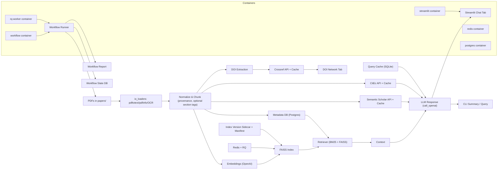

Ragonometrics - RAG pipeline for economics papers
============================================

Overview
--------
Ragonometrics ingests PDFs, extracts per-page text for provenance, chunks with overlap, embeds chunks, indexes with FAISS, and serves retrieval + LLM summaries via CLI and a Streamlit UI. External metadata is enriched via Semantic Scholar and CitEc when available, and DOI metadata can be fetched from Crossref and cached. The system is designed to be reproducible, auditable, and scalable from local runs to a Postgres-backed deployment.

This repo is a combination of coding + vibe coding.

Quick Start
-----------
1. Install dependencies in your enviroment.

```bash
python -m pip install -e .
```

2. Install Poppler (provides `pdftotext` and `pdfinfo`). On Windows, add Poppler `bin` to PATH.

3. Set your OpenAI API key in the .env file.

4. Place PDFs in `papers/` (e.g., `papers/example.pdf`) or set `PAPERS_DIR`.

5. Run the summarizer.

```bash
python -m ragonometrics.core.main
```

CLI and Workflow
----------------
See `docs/workflow.md` for CLI usage and workflow examples.

Docker
------
See `docs/docker.md` for container usage.


Streamlit App
-------------
See `docs/ui.md` for UI usage and notes.

Configuration
-------------
See `docs/configuration.md` for `config.toml` usage and environment variables.
Quick start:
- Edit `config.toml` or set `RAG_CONFIG=/path/to/config.toml`.
- Use env vars to override values in containers/CI.

Components and Files
--------------------
- Prompts: `ragonometrics/core/prompts.py`.
- IO + preprocessing: `ragonometrics/core/io_loaders.py`.
- Summarizer entrypoint: `ragonometrics/core/main.py`.
- Pipeline tools (chunk summaries, citations, metadata): `ragonometrics/pipeline/pipeline.py`.
- Indexing: `ragonometrics/indexing/indexer.py` (FAISS + Postgres metadata).
- Retrieval: `ragonometrics/indexing/retriever.py` (hybrid BM25 + FAISS).
- Streamlit UI: `ragonometrics/ui/streamlit_app.py`.
- Queue worker: `ragonometrics/integrations/rq_queue.py` (Redis + RQ).
- Crossref cache: `ragonometrics/integrations/crossref_cache.py` (Postgres cache).
- Semantic Scholar: `ragonometrics/integrations/semantic_scholar.py`.
- CitEc: `ragonometrics/integrations/citec.py`.
- Econ data: `ragonometrics/integrations/econ_data.py` (FRED/World Bank).
- Workflow state: `ragonometrics/pipeline/state.py`.
- Workflow runner: `ragonometrics/pipeline/workflow.py`.
- Benchmarks: `ragonometrics/eval/benchmark.py` and wrapper `tools/benchmark.py`.

Package Layout
--------------
- `ragonometrics/core/`: ingestion, config, prompts, and core retrieval utilities.
- `ragonometrics/pipeline/`: LLM orchestration, caching, and token usage.
- `ragonometrics/indexing/`: FAISS indexing, metadata, manifests, and retrieval.
- `ragonometrics/integrations/`: Crossref and Redis/RQ integrations.
- `ragonometrics/ui/`: Streamlit UI.
- `ragonometrics/eval/`: evaluation and benchmarking tools.
- `ragonometrics/cli/`: CLI entrypoints.

Indexing and Retrieval
----------------------
See `docs/indexing.md` for indexing, DOI network, and queueing details.

Benchmarks
----------
- `tools/benchmark.py` runs indexing and chunking benchmarks against sample PDFs.
- `ragonometrics/eval/benchmark.py` supports retrieval benchmarks and OCR forcing.

Economics Data
--------------
- Example econ workflow: `tools/econ_workflow.py`.
- Schema notes: `docs/econ_schema.md`.

Documentation
-------------
- Architecture: `docs/architecture.md`
- Workflow Architecture: `docs/workflow_architecture.md`
- Configuration: `docs/configuration.md`
- Docker: `docs/docker.md`
- Workflow and CLI: `docs/workflow.md`
- Indexing and Retrieval: `docs/indexing.md`
- Streamlit UI: `docs/ui.md`
- Cloud deployment: `docs/cloud.md`
- Agentic workflow: `docs/agentic.md`
- Econ schema: `docs/econ_schema.md`
- Onboarding: `docs/onboarding.md`
- Contributing: `docs/contributing.md`
- ADRs: `docs/adr/`

Knowledge Sharing
-----------------
- Weekly 30-minute walkthrough of recent changes
- Architecture review for meaningful refactors
- Short internal workshops (pipeline, retrieval, workflow state)

Troubleshooting
---------------
See `docs/troubleshooting.md`.

Architecture Diagram (Mermaid)
------------------------------


Architecture
------------
See `docs/architecture.md` for design rationale, scaling notes, and operational guidance.

