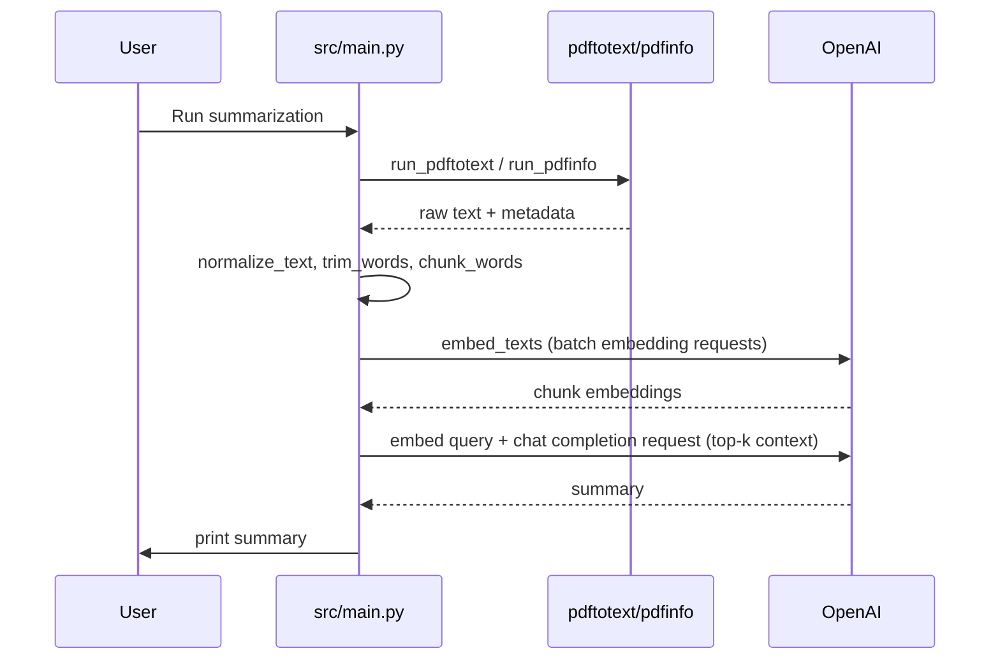

Ragonomics — RAG pipeline for economics papers
==============================================

Overview
--------
Ragonomics provides a small Retrieval-Augmented Generation (RAG) pipeline for summarizing economics research papers. The pipeline converts PDF papers to text, normalizes and chunks the text, creates embeddings for chunks, retrieves the top-k most relevant chunks for a query, and uses an OpenAI chat model to produce concise summaries focused on research question, methods, findings, and implications.

Quick Start
-----------
1. Install Python dependencies (use your venv):

```bash
pip install -r requirements.txt
```

2. Install Poppler (provides `pdftotext` and `pdfinfo`). On Windows, install Poppler and add its `bin` directory to PATH.

3. Set your OpenAI API key in the environment:

```powershell
$env:OPENAI_API_KEY = "sk-..."
```

4. Place PDFs in the papers directory (default: project `papers/`), or set `PAPERS_DIR`.

5. Run the script (example):

```bash
python -m src.main
# or use the package CLI if installed: ragonomics-cli summarize --paper "papers/my_paper.pdf"
```

Configuration & Env Vars
------------------------
- `PAPERS_DIR` — directory with PDFs. Default: `PROJECT_ROOT/papers`.
- `MAX_PAPERS` — how many PDFs to process (default `3`).
- `MAX_WORDS` — maximum words to use from a paper (default `12000`).
- `CHUNK_WORDS` — words per chunk (default `350` in `src/main.py`).
- `CHUNK_OVERLAP` — overlap between chunks (default `50`).
- `TOP_K` — how many chunks to retrieve for context (default `6`).
- `EMBED_BATCH` — batch size for embedding requests (default `64`).
- `EMBEDDING_MODEL` — embedding model name (default `text-embedding-3-small` in code). Set via env.
- `OPENAI_MODEL` / `CHAT_MODEL` — chat model used for summarization (default `gpt-5-nano` fallback in code).

Files and Component Mapping
---------------------------
- Extraction
  - `src/main.py`: `run_pdftotext(path)` — calls `pdftotext -layout` to extract raw text.
  - `src/main.py`: `run_pdfinfo(path)` — calls `pdfinfo` to get `title` and `author`.
- Preprocessing
  - `src/main.py`: `normalize_text(text)` — removes nulls and squashes whitespace.
  - `src/main.py`: `trim_words(text, max_words)` — truncates to `MAX_WORDS`.
- Chunking
  - `src/main.py`: `chunk_words(text, chunk_words, overlap_words)` — creates word-based chunks.
- Embeddings
  - `src/main.py`: `embed_texts(client, texts, model, batch_size)` — batches calls to OpenAI `embeddings.create`.
- Retrieval
  - `src/main.py`: `cosine(a, b)` — cosine similarity implementation.
  - `src/main.py`: `top_k_context(chunks, chunk_embeddings, query, client, settings)` — computes query embedding and returns the top-k chunks.
- Generation
  - `src/main.py`: `summarize_paper(client, paper, settings)` — builds the prompt and calls `client.chat.completions.create` to get the summary.

Runtime Notes & Example Output
------------------------------
- If `pdftotext` is missing, `run_pdftotext` raises: "pdftotext is not available. Install Poppler or TeXLive.".
- If the papers directory is missing or empty, the script exits with a `SystemExit` message.
- The script prints a header per paper similar to:

```
Hello world RAG summary for economics papers
Using 1 paper(s) from papers/
================================================================================
Title of Paper  |  Author Name  |  filename.pdf
- bullet 1
- bullet 2
- bullet 3
```

Troubleshooting & Limitations
-----------------------------
- System dependencies: ensure `pdftotext` and `pdfinfo` are installed and on PATH.
- OpenAI credentials: set `OPENAI_API_KEY` or configure the OpenAI client appropriately.
- In-memory embeddings: the current implementation keeps embeddings in memory for a single run; there is no persistent vector DB.
- Model and cost: choose embedding/chat models thoughtfully to balance quality and cost.
- No explicit license file in the repo — consider adding one if you plan to publish.

Extensibility & Next Steps
--------------------------
- Persist embeddings in a vector database (FAISS, Milvus, Pinecone) to avoid re-embedding every run.
- Add unit tests around `chunk_words`, `trim_words`, and the `top_k_context` ranking behavior.
- Make the retriever pluggable and add support for semantic reranking.
- Add a configuration file (`config.toml` or `pyproject` entries) to make parameters easier to override.

Architecture Diagram (Mermaid)
------------------------------



Contact / Contributing
----------------------
If you'd like, I can:
- Expand this into a full `docs/` folder with separate pages.
- Add unit tests and a CI job for the pipeline.
- Integrate a vector DB example and show persistent indexing.

---

(Generated from the repository `src/main.py` and project layout.)

Streamlit App
-------------
A simple Streamlit-based chatbot is available at `src/streamlit_app.py`. It lets you select a PDF from the `PAPERS_DIR`, prepares chunks and embeddings, and ask questions interactively. It uses the same embedding and chat models configured via env vars.

Run the local app:

```bash
pip install -r requirements.txt
streamlit run src/streamlit_app.py
```

Notes:
- Ensure `OPENAI_API_KEY` is set in your environment.
- Make sure `pdftotext`/`pdfinfo` (Poppler) are installed and on PATH.
