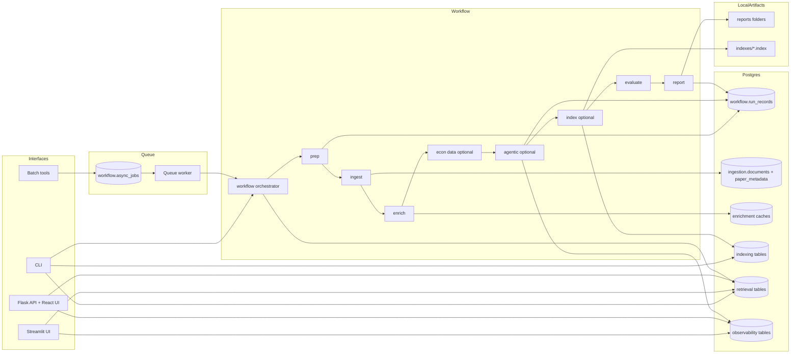

# Ragonometrics Architecture: Decisions and Rationale

This document summarizes the current Ragonometrics architecture, design tradeoffs, and operational guidance.

Overview
--------
Ragonometrics ingests PDFs, extracts per-page text for provenance, chunks with overlap, embeds chunks, persists runtime metadata in Postgres, and serves retrieval + LLM summaries via CLI, Streamlit, and a Flask API + React web UI. The system enriches papers with external metadata (OpenAlex and CitEc), supports async workflow execution through a Postgres-backed queue, and remains reproducible through run-level state/report recording plus filesystem artifacts.

Architecture Diagram
--------------------

Entity Relationship Diagram (ERD)
---------------------------------
- Full ERD is maintained in [`docs/architecture/data-model-erd.md`](https://github.com/badbayesian/ragonometrics/blob/main/docs/architecture/data-model-erd.md).
- Source schema for the ERD: [`deploy/sql/001_unified_postgres_schema.sql`](https://github.com/badbayesian/ragonometrics/blob/main/deploy/sql/001_unified_postgres_schema.sql).

Key Components
--------------
- Config and prompts
  - [`config.toml`](https://github.com/badbayesian/ragonometrics/blob/main/config.toml) (optional) is the primary configuration surface with env-var overrides.
  - Centralized prompts live in [`ragonometrics/core/prompts.py`](https://github.com/badbayesian/ragonometrics/blob/main/ragonometrics/core/prompts.py).
- Package layout (logical groupings)
  - [`ragonometrics/core/`](https://github.com/badbayesian/ragonometrics/tree/main/ragonometrics/core): settings, ingestion, extraction, core prompts, logging.
  - [`ragonometrics/pipeline/`](https://github.com/badbayesian/ragonometrics/tree/main/ragonometrics/pipeline): LLM call wrapper, query cache, token usage accounting.
  - [`ragonometrics/indexing/`](https://github.com/badbayesian/ragonometrics/tree/main/ragonometrics/indexing): FAISS indexing, Postgres metadata, and hybrid retrieval.
- [`ragonometrics/integrations/`](https://github.com/badbayesian/ragonometrics/tree/main/ragonometrics/integrations): OpenAlex, CitEc, econ data, and async queue jobs.
  - [`ragonometrics/ui/`](https://github.com/badbayesian/ragonometrics/tree/main/ragonometrics/ui): Streamlit app.
  - [`ragonometrics/eval/`](https://github.com/badbayesian/ragonometrics/tree/main/ragonometrics/eval): eval + benchmark tooling.
- PDF extraction and preprocessing
  - `pdftotext` + `pdfinfo` (Poppler) with OCR fallback.
  - Per-page extraction supports provenance (page + word offsets).
  - Optional section-aware chunking (title/abstract/introduction/methods/results) via `SECTION_AWARE_CHUNKING`.
- Embeddings and retrieval
  - Provider-routed embeddings via `ragonometrics/llm/runtime.py` and `embed_texts` (OpenAI, Anthropic-compatible routing, or OpenAI-compatible endpoints).
  - Hybrid BM25 + Postgres vector retrieval when `DATABASE_URL` is configured, with FAISS fallback.
  - Optional query expansion (`QUERY_EXPANSION`) and LLM reranking (`RERANKER_MODEL`, `RERANK_TOP_N`).
- Indexing
  - FAISS `IndexFlatIP` with normalized vectors.
  - Index versions are tracked with `index_id` and a sidecar JSON next to FAISS artifacts.
  - Postgres metadata stores vectors, index shards, and index version rows.
  - Idempotent indexing based on a deterministic key (same corpus + params).
- UI and CLI
  - Streamlit UI ([`ragonometrics/ui/streamlit_app.py`](https://github.com/badbayesian/ragonometrics/blob/main/ragonometrics/ui/streamlit_app.py)) provides Chat, Structured Workstream, OpenAlex Metadata, Citation Network, and Usage tabs.
  - Flask API + React web app ([`ragonometrics/web/`](https://github.com/badbayesian/ragonometrics/tree/main/ragonometrics/web), [`webapp/`](https://github.com/badbayesian/ragonometrics/tree/main/webapp)) provides multi-user auth/session, paper-scoped chat, structured generation/export, and usage endpoints.
  - Structured Workstream export supports `Compact` and `Full` modes. Full mode resolves rich question payloads from `workflow.run_records` and includes confidence/retrieval/citation-anchor fields when available.
  - External metadata (OpenAlex with CitEc fallback) is shown in a UI expander and injected into prompts.
  - Console entrypoints: `ragonometrics index | query | ui | benchmark | workflow | store-metadata | store-openalex-metadata | store-workflow-reports | db migrate | usage`.
- Agentic workflow
  - [`ragonometrics/pipeline/workflow.py`](https://github.com/badbayesian/ragonometrics/blob/main/ragonometrics/pipeline/workflow.py) orchestrates prep -> ingest -> enrich -> index -> evaluate -> report.
  - State persisted in Postgres (`workflow.run_records`) via [`ragonometrics/pipeline/state.py`](https://github.com/badbayesian/ragonometrics/blob/main/ragonometrics/pipeline/state.py) and [`ragonometrics/pipeline/report_store.py`](https://github.com/badbayesian/ragonometrics/blob/main/ragonometrics/pipeline/report_store.py).
  - Optional async execution with a Postgres-backed queue ([`ragonometrics/integrations/rq_queue.py`](https://github.com/badbayesian/ragonometrics/blob/main/ragonometrics/integrations/rq_queue.py)).
  - Optional agentic step plans sub-questions, retrieves context, and synthesizes an answer.
- Caching
  - OpenAlex HTTP response cache in Postgres (`enrichment.openalex_http_cache`).
  - Canonical per-paper OpenAlex match payloads in Postgres (`enrichment.paper_openalex_metadata`).
  - OpenAlex lookup includes deterministic title-variant fallback in core lookup (`fetch_openalex_metadata`) for robust matching of common title-token variants.
  - CitEc metadata cache in Postgres (`enrichment.citec_cache`).
  - Query/answer cache in Postgres (`retrieval.query_cache`).
  - Token usage in Postgres (`observability.token_usage`).

Data and Metadata Stores
------------------------
- Postgres (`DATABASE_URL`):
  - Auth: `auth.streamlit_users`, `auth.streamlit_sessions`, `auth.request_rate_limits` (shared Streamlit/Flask auth/session/rate-limit persistence).
  - Ingestion: `ingestion.documents`, `ingestion.paper_metadata` (`ingestion.prep_manifests` is present in schema for optional prep-manifest persistence/backfills).
  - Enrichment: `enrichment.openalex_http_cache`, `enrichment.paper_openalex_metadata`, `enrichment.openalex_title_overrides`, `enrichment.citec_cache`.
  - Indexing: `indexing.vectors`, `indexing.index_shards`, `indexing.index_versions`, `indexing.pipeline_runs`.
  - Workflow: `workflow.run_records` (`record_kind`: `run|step|report|question|artifact|workstream_link`).
  - Retrieval: `retrieval.query_cache` (`retrieval.retrieval_events` is available for retrieval diagnostics).
  - Observability: `observability.token_usage`, `observability.request_failures`.
- Local artifacts:
  - FAISS indexes in [`vectors.index`](https://github.com/badbayesian/ragonometrics/blob/main/vectors.index) and versioned shards in [`indexes/`](https://github.com/badbayesian/ragonometrics/tree/main/indexes).
  - Index version sidecar JSON next to each shard.
  - Workflow report artifacts are written under [`reports/`](https://github.com/badbayesian/ragonometrics/tree/main/reports) by default (`workflow-report-<run_id>.json`, `prep-manifest-<run_id>.json`, `audit-workflow-report-<run_id>.*`).
  - Teams may organize artifacts into subfolders like [`reports/workflow/`](https://github.com/badbayesian/ragonometrics/tree/main/reports/workflow), [`reports/prep/`](https://github.com/badbayesian/ragonometrics/tree/main/reports/prep), [`reports/audit/`](https://github.com/badbayesian/ragonometrics/tree/main/reports/audit), and [`reports/workstream/`](https://github.com/badbayesian/ragonometrics/tree/main/reports/workstream).

Reproducibility
---------------
- A config hash is computed from effective settings (config + env overrides).
- [`config.toml`](https://github.com/badbayesian/ragonometrics/blob/main/config.toml) is the primary config surface; env vars override for deploys.
- A prep manifest records corpus fingerprints and file-level metadata before ingestion.
- Each indexing run writes a manifest JSON next to the index shard containing:
  - git SHA, dependency fingerprints, config hash + effective config snapshot.
  - corpus fingerprint, embedding dim + hashes, chunking scheme, timestamps, and artifact paths.
  - deterministic paper list with stable `doc_id`s and per-chunk `chunk_id` + `chunk_hash` entries for diffable runs.

Tradeoffs
---------
- **Local-only (FAISS artifacts) vs Postgres-backed metadata**: Local artifacts are fast and low-friction but limited for shared access. Postgres adds infra overhead but enables multi-user metadata, hybrid retrieval, and durable state/report caching.
- **Determinism vs throughput**: Stable ordering, chunk hashes, and manifest recording improve auditability but add compute and I/O overhead during ingestion and indexing.
- **Agentic depth vs cost**: Agentic workflows improve coverage and synthesis quality but increase latency and token usage; structured questions are cheaper and more predictable.
- **Citations and provenance vs speed**: Citation extraction and page-level provenance improve trustworthiness but add extra parsing and retrieval work.
- **Hybrid retrieval vs simplicity**: BM25 + reranking can improve relevance but introduces more tuning surface and failure modes compared to pure vector search.

Retrieval Quality Controls
--------------------------
- Optional query expansion and LLM reranking to improve relevance.
- Section-aware chunking enriches chunk metadata and retrieval provenance.
- Guardrails prevent retrieval when the FAISS shard and DB `index_id` disagree.

Operational Hardening
---------------------
- Idempotent indexing: same corpus + params does not double-insert.
- Structured JSON logging for key operations.
- OpenAI calls include retries and failure recording in Postgres.
- OpenAlex and CitEc calls include retries and local caching.

Economics Data
--------------
- FRED and World Bank connectors live in [`ragonometrics/integrations/econ_data.py`](https://github.com/badbayesian/ragonometrics/blob/main/ragonometrics/integrations/econ_data.py).
- Example workflow in [`tools/econ_workflow.py`](https://github.com/badbayesian/ragonometrics/blob/main/tools/econ_workflow.py) (see archived reference [`docs/archive/data/econ_schema.md`](https://github.com/badbayesian/ragonometrics/blob/main/docs/archive/data/econ_schema.md)).

Evaluation
----------
- [`ragonometrics/eval/eval.py`](https://github.com/badbayesian/ragonometrics/blob/main/ragonometrics/eval/eval.py) provides retrieval metrics (recall@k, MRR) and answer proxies
  (citation coverage, hallucination proxy, self-consistency).
- Golden-set format supports curated Q/A and expected citations.

Queueing
--------
- Postgres-backed async jobs table + worker ([`ragonometrics/integrations/rq_queue.py`](https://github.com/badbayesian/ragonometrics/blob/main/ragonometrics/integrations/rq_queue.py)).

Benchmarks
----------
- [`ragonometrics/eval/benchmark.py`](https://github.com/badbayesian/ragonometrics/blob/main/ragonometrics/eval/benchmark.py) and [`tools/benchmark.py`](https://github.com/badbayesian/ragonometrics/blob/main/tools/benchmark.py) measure indexing, chunking, and retrieval timing.

Entrypoints
-----------
- `ragonometrics index` builds FAISS indexes.
- `ragonometrics query` runs a question against a paper.
- `ragonometrics ui` launches the Streamlit UI.
- `ragonometrics web` launches the Flask API + SPA surface.
- `ragonometrics benchmark` runs the benchmark suite.
- `ragonometrics workflow` runs the multi-step (optionally agentic) workflow.

Containerization
----------------
- [`Dockerfile`](https://github.com/badbayesian/ragonometrics/blob/main/Dockerfile) installs package dependencies and Poppler.
- [`compose.yml`](https://github.com/badbayesian/ragonometrics/blob/main/compose.yml) defines core runtime services plus profile-gated batch services.
- Default `docker compose up -d --build` starts `postgres`, `streamlit`, `rq-worker`, and `pgadmin`.
- Batch jobs (`worker`, `indexer`, `workflow`) are started explicitly with `--profile batch`.
- Services run code from the image by default; add a bind mount for live code editing if desired.

