# Postgres ERD (Web App)

This ERD summarizes the main runtime tables used by the web app and workflow runtime.

## Entity Relationship Diagram

```mermaid
erDiagram
    AUTH_USERS ||--o{ AUTH_SESSIONS : owns
    AUTH_USERS ||--o{ PROJECT_MEMBERSHIPS : joins
    PROJECTS ||--o{ PROJECT_MEMBERSHIPS : has
    PROJECTS ||--o{ PROJECT_PAPERS : allowlists
    PROJECTS ||--o{ PROJECT_PERSONAS : has
    PROJECTS ||--|| PROJECT_SETTINGS : configures

    AUTH_SESSIONS ||--o{ CHAT_HISTORY_TURNS : produces
    AUTH_USERS ||--o{ CHAT_HISTORY_TURNS : asks
    PROJECTS ||--o{ CHAT_HISTORY_TURNS : scopes

    AUTH_USERS ||--o{ PAPER_NOTES : writes
    PROJECTS ||--o{ PAPER_NOTES : scopes

    PROJECTS ||--o{ PAPER_COMPARISON_RUNS : owns
    PAPER_COMPARISON_RUNS ||--o{ PAPER_COMPARISON_CELLS : contains

    WORKFLOW_RUN_RECORDS ||--o{ TOKEN_USAGE : emits
    WORKFLOW_RUN_RECORDS ||--o{ REQUEST_FAILURES : may_log
    PROJECTS ||--o{ PROJECT_QUERY_CACHE : scopes

    AUTH_USERS {
      bigint id PK
      text username
      text email
      bool is_active
    }
    AUTH_SESSIONS {
      text session_id PK
      bigint user_id FK
      text current_project_id
      text current_persona_id
      timestamp authenticated_at
    }
    PROJECTS {
      text project_id PK
      text name
      text slug
      bool is_active
    }
    PROJECT_MEMBERSHIPS {
      bigint id PK
      text project_id FK
      bigint user_id FK
      text role
      bool is_active
    }
    PROJECT_PAPERS {
      bigint id PK
      text project_id FK
      text paper_id
      text paper_path
      bigint added_by_user_id
    }
    PROJECT_PERSONAS {
      text persona_id PK
      text project_id FK
      text name
      bool is_default
      bool is_active
    }
    PROJECT_SETTINGS {
      text project_id PK
      bool allow_cross_project_answer_reuse
      bool allow_custom_question_sharing
      text default_persona_id
    }
    CHAT_HISTORY_TURNS {
      bigint id PK
      bigint user_id FK
      text session_id FK
      text project_id FK
      text paper_id
      text query
      text answer
      timestamp created_at
    }
    PAPER_NOTES {
      bigint id PK
      bigint user_id FK
      text project_id FK
      text paper_id
      int page_number
      text note_text
    }
    PAPER_COMPARISON_RUNS {
      text comparison_id PK
      bigint created_by_user_id FK
      text project_id FK
      text status
      timestamp created_at
    }
    PAPER_COMPARISON_CELLS {
      bigint id PK
      text comparison_id FK
      text paper_id
      text question_id
      text cell_status
      text answer
    }
    WORKFLOW_RUN_RECORDS {
      bigint id PK
      text run_id
      text record_kind
      text step
      text status
      text project_id
      timestamp created_at
    }
    PROJECT_QUERY_CACHE {
      text project_cache_key PK
      text project_id FK
      text cache_key
      text query
      text answer
    }
    TOKEN_USAGE {
      bigint id PK
      text run_id
      text model
      int total_tokens
      timestamp created_at
    }
    REQUEST_FAILURES {
      bigint id PK
      text component
      text error
      timestamp created_at
    }
```

## Core Schemas by Responsibility

- `auth`: users, sessions, projects, memberships, personas, settings, rate limits
- `workflow`: run records and async jobs
- `retrieval`: query cache and project query cache
- `observability`: token usage and failures
- `enrichment`: OpenAlex/CitEc metadata and citation graph cache
- `ingestion` and `indexing`: extracted documents, metadata, vectors, shard/version data

## Related Documents

- [System architecture](architecture.md)
- [Workflow architecture](workflow_architecture.md)
- [Workflow guide](../guides/workflow.md)
