# Ragonometrics Data Model ERD

This diagram reflects the unified Postgres schema in `deploy/sql/001_unified_postgres_schema.sql`.

```mermaid
erDiagram
  INGESTION_DOCUMENTS {
    text doc_id PK
    text path
    text title
    text author
    timestamptz extracted_at
    text file_hash
    text text_hash
  }

  INGESTION_PAPER_METADATA {
    text doc_id PK
    text primary_doi
    text openalex_id
    int publication_year
    text repec_handle
    timestamptz updated_at
  }

  INGESTION_PREP_MANIFESTS {
    text run_id PK
    timestamptz created_at
    text corpus_hash
    jsonb payload
  }

  AUTH_STREAMLIT_USERS {
    bigint id PK
    text username
    text password_hash
    bool is_active
    timestamptz last_login_at
    timestamptz created_at
    timestamptz updated_at
  }

  AUTH_STREAMLIT_SESSIONS {
    bigint id PK
    text session_id
    bigint user_id FK
    text username
    text source
    timestamptz authenticated_at
    timestamptz revoked_at
    timestamptz created_at
    timestamptz updated_at
  }

  ENRICHMENT_OPENALEX_CACHE {
    text cache_key PK
    text work_id
    text query
    timestamptz fetched_at
  }

  ENRICHMENT_OPENALEX_TITLE_OVERRIDES {
    bigint id PK
    text title_pattern
    text match_type
    text openalex_work_id
    int priority
    bool enabled
    timestamptz updated_at
  }

  ENRICHMENT_CITEC_CACHE {
    text cache_key PK
    text repec_handle
    timestamptz fetched_at
  }

  ENRICHMENT_PAPER_OPENALEX_METADATA {
    text paper_path PK
    text title
    text authors
    text query_title
    text query_authors
    int query_year
    text openalex_id
    text openalex_doi
    text openalex_title
    int openalex_publication_year
    text match_status
    timestamptz updated_at
  }

  INDEXING_PIPELINE_RUNS {
    bigint id PK
    text workflow_run_id
    text workstream_id
    text arm
    text idempotency_key
    timestamptz created_at
  }

  INDEXING_INDEX_VERSIONS {
    text index_id PK
    timestamptz created_at
    text embedding_model
    int chunk_words
    int chunk_overlap
    text corpus_fingerprint
  }

  INDEXING_INDEX_SHARDS {
    bigint id PK
    text shard_name
    bigint pipeline_run_id FK
    text index_id FK
    bool is_active
    timestamptz created_at
  }

  INDEXING_VECTORS {
    bigint id PK
    text doc_id FK
    text chunk_id
    text chunk_hash
    bigint pipeline_run_id FK
    int page
    int start_word
    int end_word
    timestamptz created_at
  }

  WORKFLOW_RUN_RECORDS {
    bigint id PK
    text run_id
    text record_kind
    text step
    text record_key
    text status
    text workstream_id
    text arm
    text trigger_source
    timestamptz created_at
  }

  WORKFLOW_ASYNC_JOBS {
    bigint id PK
    text job_id
    text queue_name
    text job_type
    text status
    int attempt_count
    timestamptz available_at
    timestamptz created_at
  }

  RETRIEVAL_QUERY_CACHE {
    text cache_key PK
    text query
    text paper_path
    text model
    timestamptz created_at
  }

  RETRIEVAL_RETRIEVAL_EVENTS {
    bigint id PK
    timestamptz created_at
    text run_id
    text request_id
    text method
    int top_k
  }

  OBSERVABILITY_TOKEN_USAGE {
    bigint id PK
    timestamptz created_at
    text model
    text operation
    text step
    text question_id
    int total_tokens
    text run_id
  }

  OBSERVABILITY_REQUEST_FAILURES {
    bigint id PK
    text component
    text error
    timestamptz created_at
  }

  AUTH_STREAMLIT_USERS ||--o{ AUTH_STREAMLIT_SESSIONS : "user_id"
  INGESTION_DOCUMENTS ||--|| INGESTION_PAPER_METADATA : "doc_id"
  INGESTION_DOCUMENTS ||--o{ INDEXING_VECTORS : "doc_id"
  INDEXING_PIPELINE_RUNS ||--o{ INDEXING_VECTORS : "pipeline_run_id"
  INDEXING_PIPELINE_RUNS ||--o{ INDEXING_INDEX_SHARDS : "pipeline_run_id"
  INDEXING_INDEX_VERSIONS ||--o{ INDEXING_INDEX_SHARDS : "index_id"
```

Run-Lineage Links (Not Enforced as Foreign Keys)
------------------------------------------------
- `WORKFLOW_RUN_RECORDS.run_id` is the canonical workflow lineage key.
- `OBSERVABILITY_TOKEN_USAGE.run_id` links usage to a run.
- `RETRIEVAL_RETRIEVAL_EVENTS.run_id` links retrieval traces to a run.
- `INDEXING_PIPELINE_RUNS.workflow_run_id` links index builds to workflow runs.
- `INGESTION_PREP_MANIFESTS.run_id` links preflight manifests to workflow runs.
- Streamlit auth and session history live under `auth.streamlit_users` and `auth.streamlit_sessions`.
- OpenAlex manual title pinning rules live in `enrichment.openalex_title_overrides`.

These links are intentionally flexible to support partial runs, async jobs, and backfills.
