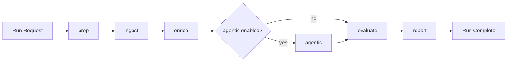

# Workflow Architecture

This document describes how workflow runs are executed, persisted, and surfaced in the web app.

## Execution Modes

- Synchronous: run in the workflow container and return when finished.
- Asynchronous: enqueue into `workflow.async_jobs` and process with `rq-worker`.

## Stage Pipeline

## Persistence Model

- `workflow.run_records` stores run, stage, and question-level artifacts.
- `workflow.async_jobs` stores queued jobs and execution state.
- `observability.token_usage` stores model/token metrics.
- `retrieval.query_cache` stores reusable answer payloads.

## Web App Integration

- `/api/v1/workflow/runs` lists paper-scoped runs.
- `/api/v1/workflow/runs/{run_id}/steps` returns top-level stages and optional internals.
- Structured export endpoints read workflow artifacts and produce JSON/PDF output.

## Failure Behavior

- Stage failures are recorded per run record with typed status.
- Async jobs retain error text and retry metadata.
- APIs return typed error envelopes for UI-safe handling.

## Related Documents

- [System architecture](architecture.md)
- [Postgres ERD](data-model-erd.md)
- [Workflow guide](../guides/workflow.md)
